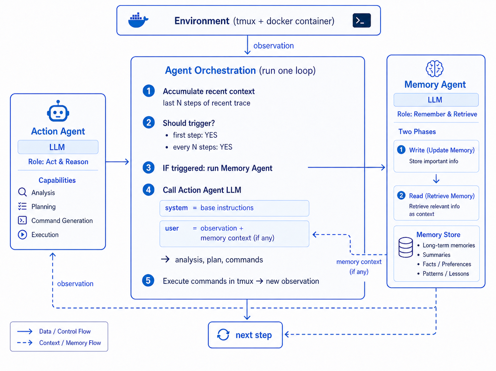
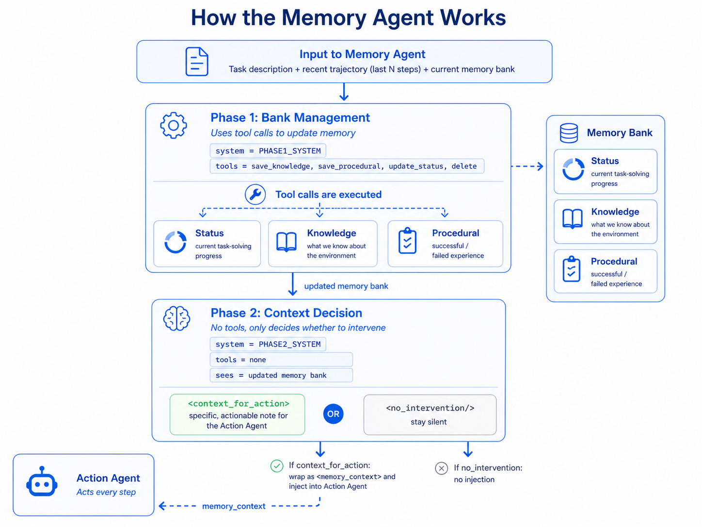

<h1 align="center">Remember When It Matters: Proactive Memory Agent for Long-Horizon Agents</h1>

<p align="center">
  <a href="https://huggingface.co/papers/2607.08716"></a>
  <a href="LICENSE"></a>
</p>

---

As a trajectory grows, the state that should drive the next action — requirements, environment facts, prior attempts, diagnoses, open subgoals — gets buried in the context window or pushed past it, and stops influencing decisions when it's needed. We call this **behavioral state decay**, and treat memory as an *active intervention* rather than passive retrieval. **Proactive Memory Agent** runs a plug-and-play memory agent alongside an unmodified action agent: it reads the recent trajectory, manages a structured memory bank, and decides whether to inject a memory-grounded reminder to the action agent or stay silent.

---

## Examples

Rendered agent trajectories (open in browser via [raw.githack.com](https://raw.githack.com)):

| Task | Baseline | Memory (action agent trajectory) | Memory (memory agent trajectory) |
|---|---|---|---|
| git-multibranch | [action agent trajectory](https://raw.githack.com/yifannnwu/proactive-memory-agent/main/examples/git-multibranch/baseline-sonnet/trajectory_agent.html) | [action agent trajectory](https://raw.githack.com/yifannnwu/proactive-memory-agent/main/examples/git-multibranch/memory-v3-opus/trajectory_agent.html) | [memory agent trajectory](https://raw.githack.com/yifannnwu/proactive-memory-agent/main/examples/git-multibranch/memory-v3-opus/trajectory_memory.html) |
| regex-log | [action agent trajectory](https://raw.githack.com/yifannnwu/proactive-memory-agent/main/examples/regex-log/baseline-sonnet/trajectory_agent.html) | [action agent trajectory](https://raw.githack.com/yifannnwu/proactive-memory-agent/main/examples/regex-log/memory-v3-opus/trajectory_agent.html) | [memory agent trajectory](https://raw.githack.com/yifannnwu/proactive-memory-agent/main/examples/regex-log/memory-v3-opus/trajectory_memory.html) |
| sqlite-with-gcov | [action agent trajectory](https://raw.githack.com/yifannnwu/proactive-memory-agent/main/examples/sqlite-with-gcov/baseline-sonnet/trajectory_agent.html) | [action agent trajectory](https://raw.githack.com/yifannnwu/proactive-memory-agent/main/examples/sqlite-with-gcov/memory-v3-opus/trajectory_agent.html) | [memory agent trajectory](https://raw.githack.com/yifannnwu/proactive-memory-agent/main/examples/sqlite-with-gcov/memory-v3-opus/trajectory_memory.html) |
| hf-model-inference | [action agent trajectory](https://raw.githack.com/yifannnwu/proactive-memory-agent/main/examples/hf-model-inference/baseline-sonnet/trajectory_agent.html) | [action agent trajectory](https://raw.githack.com/yifannnwu/proactive-memory-agent/main/examples/hf-model-inference/memory-v3-opus/trajectory_agent.html) | [memory agent trajectory](https://raw.githack.com/yifannnwu/proactive-memory-agent/main/examples/hf-model-inference/memory-v3-opus/trajectory_memory.html) |
| adaptive-rejection-sampler | [action agent trajectory](https://raw.githack.com/yifannnwu/proactive-memory-agent/main/examples/adaptive-rejection-sampler/baseline-sonnet/trajectory_agent.html) | [action agent trajectory](https://raw.githack.com/yifannnwu/proactive-memory-agent/main/examples/adaptive-rejection-sampler/memory-v3-opus/trajectory_agent.html) | [memory agent trajectory](https://raw.githack.com/yifannnwu/proactive-memory-agent/main/examples/adaptive-rejection-sampler/memory-v3-opus/trajectory_memory.html) |

---

## Architecture

**System integration.** The action agent (left) interacts with the environment;
the memory agent (right) runs alongside, observing a sliding window of recent
steps and the current memory store. At every N steps the memory agent is invoked
to update the bank and optionally inject a context reminder into the next
action-agent call.



**Memory agent internals.** Phase 1 manages the memory bank (status, knowledge,
procedural entries) through tool calls. Phase 2 reads the updated bank and either
emits a `<context_for_action>` reminder or `<no_intervention/>`.



---

## Install

```bash
git clone https://github.com/yifannnwu/proactive-memory-agent.git
cd proactive-memory-agent

# 1. Install the vendored Harbor (required by the Terminal-Bench runner)
pip install -e external/harbor

# 2. Install this package
pip install -e .
```

Python 3.12+. Uses `litellm` for LLM calls (works with OpenRouter, OpenAI,
Anthropic, local vLLM, etc.).

Quick import check:
```bash
python -c "import memory_agent; print('OK')"
python -m memory_agent.cli --help
```

---

## Terminal-Bench

The Terminal-Bench runner uses Harbor + **Enroot** for sandboxed shell execution
(chosen because our cluster is rootless and shares an FSx cache of pre-built
`.sqsh` images). Both configs run the full **terminal-bench@2.0** set (89 tasks).

> **Not using Enroot?** Harbor also ships a native Docker environment
> (`external/harbor/src/harbor/environments/docker/`). To switch, replace the
> `EnrootEnvironment` import + instantiation in `src/memory_agent/runner.py`
> (around lines 16 and 97) with Harbor's `DockerEnvironment`, and drop the
> `enroot:` block from the YAML configs (or comment it out — the `SQSH_DIR` /
> `DATA_DIR` env vars become unused).

**Environment:**
```bash
export OPENROUTER_API_KEY=sk-or-...
export SQSH_DIR=/path/to/enroot-cache      # pre-built .sqsh task images  (Enroot only)
export DATA_DIR=/path/to/enroot-data       # writable enroot data root    (Enroot only)
```

**Memory-enabled run** (Sonnet 4.5 action + Opus 4.6 memory):
```bash
python -m memory_agent.cli run configs/memory_terminalbench.yaml
```

**Baseline** (Sonnet 4.5, no memory):
```bash
python -m memory_agent.cli run configs/baseline_terminalbench.yaml
```

**Run a single task** (smoke test):
```bash
python -m memory_agent.cli run configs/baseline_terminalbench.yaml --task chess-best-move
```

**Resume an interrupted run:**
```bash
python -m memory_agent.cli run configs/memory_terminalbench.yaml \
    --resume-run-dir ./outputs/memory-terminalbench/run_<id>
```

To evaluate other action / memory model pairs, copy either YAML and edit
`model.model_name` (action) or `memory.model_name` (memory). Both fields
accept any LiteLLM-compatible name; point `api_base` at a local vLLM
endpoint for open-weight models.

---

## Layout

```
src/memory_agent/
├── memory/                    # two-phase memory core (bank, trigger, prompts)
├── memory_enabled_agent.py    # Terminal-Bench Terminus2 subclass with memory
├── runner.py                  # TB batch runner
├── cli.py                     # `memory-agent run …` entrypoint
├── config.py                  # YAML → pydantic
└── data/                      # harbor + parquet task adapters

external/harbor/               # vendored Harbor fork (Enroot + Docker environments)
configs/                       # TB inference YAMLs (memory + baseline)
```

---

## Citation

If you use MemoryAgent, please cite our [paper](https://arxiv.org/abs/2607.08716):

```bibtex
@article{wu2026memoryagent,
  title   = {Remember When It Matters: Proactive Memory Agent for Long-Horizon Agents},
  author  = {Wu, Yifan and Zhang, Lizhu and Zhou, Yuhang and Wang, Mingyi and Peng, Bo and Li, Serena and Fan, Xiangjun and Zhao, Zhuokai},
  year    = {2026},
  journal = {arXiv preprint arXiv:2607.08716},
  url     = {https://arxiv.org/abs/2607.08716}
}
```

---

## License

Apache-2.0. See `LICENSE`. `external/harbor/` is derived from
<https://github.com/laude-institute/harbor>.
